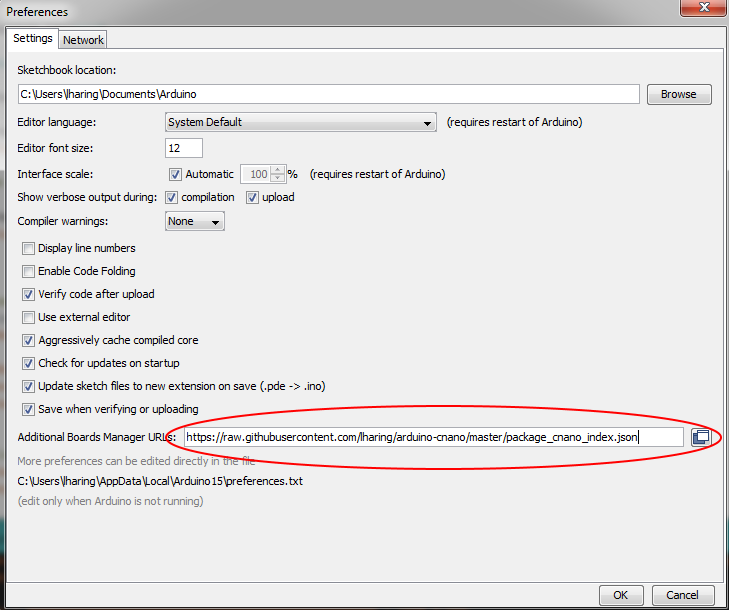

# Curiosity Nano board support package for the Arduino IDE

## Supported boards
- ATmega4809 Curiosity Nano

## Installation
### Add package index to the board manager
The URL to the package index

https://raw.githubusercontent.com/lharing/arduino-cnano/master/package_cnano_index.json

must be added to the "Additional Boards Manger URLs" in the IDE preferences.


### Install package

### Configuring avrdude

To program the board through the on-board debugger the configuration file for avrdude must be updated. The avrdude.conf can be found in the arduino package e.g. in this place on a Windows machine C:\Users\<user>\AppData\Local\Arduino15\packages\arduino\tools\avrdude\6.3.0-arduino14\etc\avrdude.conf.

Add the following lines in the file to enable the on-board debugger in the Arduino IDE Tools->Programmer menu.
```
programmer
  id    = "npkob_updi";
  desc  = "Microchip PKOB Nano UPDI mode";
  type  = "jtagice3_updi";
  connection_type = usb;
  usbpid = 0x2175;
;
```

TODO where is this file maintained by Arduino so that this can be added by a pull-request.


